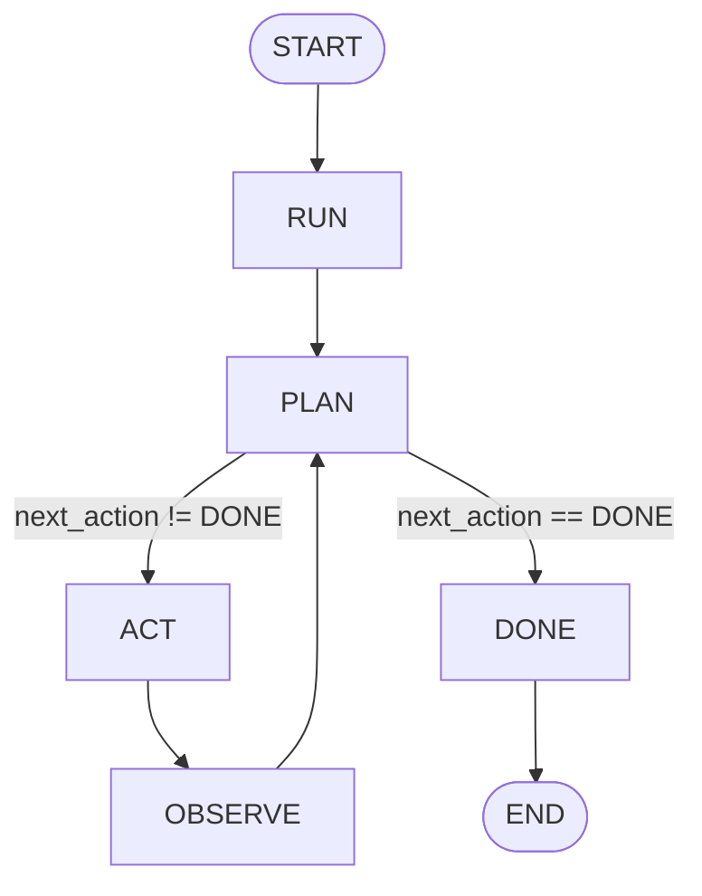

# Multimodal Investigation Agent

**Build a Multimodal AI Agent: (Plan → Act → Observe) Pattern**
An agent that analyzes files across multiple modalities (image, document, audio), gathers evidence from each, validates grounding across at least two modalities, and produces a confidence-scored answer. Includes error recovery and a fallback clarification path.

---

## Agent Purpose

The agent answers a user's natural-language question by cross-referencing evidence from multiple file types. It is designed for scenarios where a single file type is insufficient — for example, correlating a sales dashboard image with a contextual document. The agent only produces an answer when it can ground that answer in evidence from at least two distinct modalities.

---

## Accepted Modalities

| Modality     | Extensions              |
| ------------ | ----------------------- |
| **Image**    | `.png`, `.jpg`, `.jpeg` |
| **Document** | `.txt`, `.pdf`          |
| **Audio**    | `.mp3`, `.wav`, `.m4a`  |

At least two modalities must be present in the input files, otherwise the agent routes to `CLARIFY`.

---

## Tools

| Tool                          | Description                                                                   |
| ----------------------------- | ----------------------------------------------------------------------------- |
| `detect_modalities`           | Maps each input file's extension to a modality                                |
| `select_tools_for_modalities` | Maps each detected modality to its analysis tool                              |
| `analyze_image`               | Extracts a text description from an image _(currently mocked)_                |
| `analyze_document`            | Reads and returns the content of a text file                                  |
| `transcribe_audio`            | Transcribes an audio file to text _(currently mocked)_                        |
| `generate_answer`             | Concatenates evidence into a final answer string                              |
| `format_final_output`         | Formats the final state into a human-readable report                          |
| `save_output_to_file`         | Persists the final state as JSON to `outputs/run_output.json`                 |
| `append_trace`                | Appends a timestamped entry to the trace log (immutable — returns a new list) |
| `pick_next_tool`              | Picks the first selected tool whose modality has no evidence yet (else `""`)  |
| `run_tool_for_state`          | Dispatches a tool onto the first input file matching that tool's modality     |

Each analysis tool returns `{modality, content, confidence, ref}`.

---

## Agent States

The agent is a LangGraph `StateGraph`. All state lives in `AgentState` (a `TypedDict`).

| State field           | Type         | Description                                                                       |
| --------------------- | ------------ | --------------------------------------------------------------------------------- |
| `session_id`          | `str`        | Random UUID generated per run                                                     |
| `goal`                | `str`        | Fixed goal description                                                            |
| `user_question`       | `str`        | The question to answer                                                            |
| `files`               | `list[str]`  | Input file paths                                                                  |
| `detected_modalities` | `list[str]`  | Modalities found in the files                                                     |
| `selected_tools`      | `list[str]`  | Tools chosen for those modalities                                                 |
| `next_tool`           | `str`        | Tool the planner will run next                                                    |
| `evidence`            | `list[dict]` | Accumulated evidence from all tools                                               |
| `used_modalities`     | `list[str]`  | Modalities that contributed evidence                                              |
| `answer`              | `str`        | Final answer text                                                                 |
| `confidence`          | `float`      | Average of per-evidence mock confidences (rounded to 2) when grounded, else `0.4` |
| `grounded`            | `bool`       | Whether ≥2 modalities contributed evidence                                        |
| `retries`             | `int`        | Number of error-recovery retries so far                                           |
| `max_retries`         | `int`        | Maximum retries before routing to `CLARIFY` (default 2)                           |
| `trace`               | `list[dict]` | Step-by-step execution log                                                        |
| `current_state`       | `str`        | Name of the currently active graph node                                           |
| `event`               | `str`        | Last event emitted by an action (`Event.*`)                                       |
| `minimum_modalities`  | `int`        | Required distinct modalities for grounding (default 2)                            |
| `next_action`         | `str`        | Action chosen by `PLAN` (`Action.*`)                                              |
| `action_result`       | `dict`       | Raw result of the last action (merged into state by `OBSERVE`)                    |
| `actions_taken`       | `list[str]`  | History of executed actions (`Action.*`)                                          |

---

## Graph Nodes and Flow — the ReAct Loop

The graph has **5 nodes**. The agent runs a ReAct loop — _plan_ the next action, _act_ on it, _observe_ the result and update state — until the planner decides it is done.



| Node      | Role                                                                                                                       |
| --------- | -------------------------------------------------------------------------------------------------------------------------- |
| `RUN`     | Entry — seeds the `user_input_received` event                                                                              |
| `PLAN`    | Calls `planner.plan_next_action(state)` → sets `next_action`                                                               |
| `ACT`     | Dispatches `next_action` through the `actions.ACTIONS` registry; stores the raw result in `action_result` (no state merge) |
| `OBSERVE` | The **only** place action results merge into state                                                                         |
| `DONE`    | Terminal node                                                                                                              |

---

## Actions, Events.

- **Actions** — named constants and implementations in `actions.py` (`Action.*`).
- **Events** — named constants in `events.py` (`Event.*`). Every action emits an event; the next `PLAN` step decides from it.

### The PLAN decision table (`planner.plan_next_action`)

Rules are checked top to bottom:

| Condition / last event                                                                                                                                                  | Next action         |
| ----------------------------------------------------------------------------------------------------------------------------------------------------------------------- | ------------------- |
| `answer_ready` / `clarification_emitted`                                                                                                                                | `DONE`              |
| `retries > max_retries`                                                                                                                                                 | `CLARIFY`           |
| `user_input_received`                                                                                                                                                   | `INGRESS`           |
| `files_loaded`                                                                                                                                                          | `DETECT_MODALITIES` |
| `modalities_detected`                                                                                                                                                   | `SELECT_TOOLS`      |
| `tools_selected` / `tool_results_received` / `retry_available` — tool pending                                                                                           | `EXTRACT_EVIDENCE`  |
| `tools_selected` / `tool_results_received` — all tools done                                                                                                             | `VALIDATE`          |
| `tool_failed`                                                                                                                                                           | `ERROR_RECOVERY`    |
| `evidence_ready`                                                                                                                                                        | `RESPOND`           |
| any failure event (`no_files`, `no_supported_files`, `insufficient_modalities`, `no_tools_selected`, `evidence_insufficient`, `answer_ungrounded`, `retries_exhausted`) | `CLARIFY`           |
| unknown event                                                                                                                                                           | `CLARIFY`           |

`pick_next_tool` selects the first tool in `selected_tools` whose modality has not yet produced evidence, so each `EXTRACT_EVIDENCE` pass runs exactly one tool and each modality is used exactly once.

---

## How Validation Works

`validate_evidence` (in `validator.py`) is called by the `VALIDATE` node after all tools have been executed. It returns plain computed fields (`used_modalities`, `grounded`, `confidence`):

1. Collects the set of unique modalities across all gathered evidence.
2. Requires every evidence item to carry a `"ref"` (a source reference produced by the tool).
3. Sets `grounded = True` only if distinct modalities are `≥ minimum_modalities` (default 2) **and** all items have refs.
4. Assigns a confidence: the average of the per-evidence (mock) confidences, rounded to 2 decimals, if grounded — else `0.4`.
5. The `VALIDATE` action emits `evidence_ready` (grounded) or `evidence_insufficient` (not grounded); the next `PLAN` step routes to `RESPOND` or `CLARIFY` accordingly.

---

## Input Example

```python
files = [
    "examples/dashboard.png",   # image modality
    "examples/context.txt"      # document modality
]
user_question = "What is the main problem shown in the files, and what should we do next?"
```

---

## Output Example

```
Final Answer:

Based on the available multimodal evidence, here is the answer:
User question:
What is the main problem shown in the files, and what should we do next?

Evidence used:
- [image] The dashboard shows a sharp drop in the sales metric after March.
- [document] The document states: The company had supply chain issues starting in April.
...

Conclusion:
The agent found evidence from multiple modalities (document, image) and generated a grounded answer.

Answer:
Based on the available multimodal evidence:
- [image] The dashboard shows a sharp drop in the sales metric after March.  (ref: image_region examples/dashboard.png)
- [document] The document states: The company had supply chain issues starting in April.
...  (ref: doc_span examples/context.txt)

Agent Trace:
Step 1:
{'timestamp': '2026-06-12T07:03:19.405569+00:00', 'type': 'run', 'message': 'starting agent run'}
Step 2:
{'timestamp': '...', 'type': 'plan', 'next_action': 'INGRESS'}
Step 3:
{'timestamp': '...', 'type': 'act', 'action': 'INGRESS', 'message': 'Agent received user input', 'number_of_files': 2}
Step 4:
{'timestamp': '...', 'type': 'observe', 'action': 'INGRESS', 'event': 'files_loaded'}
...
Step 18:
{'timestamp': '...', 'type': 'act', 'action': 'VALIDATE', 'grounded': True, 'confidence': 0.75}
...
Step 23:
{'timestamp': '...', 'type': 'plan', 'next_action': 'DONE'}
Step 24:
{'timestamp': '...', 'type': 'done', 'message': 'Done'}
```

The full final state is also saved as JSON to `outputs/run_output.json`.

---

## Known Limitations

- **Mocked tools** — `analyze_image` and `transcribe_audio` return hardcoded strings. They do not call a real vision or speech model.
- **No LLM integration** — `generate_answer` concatenates evidence strings. There is no LLM synthesizing a coherent answer.
- **Mock confidence** — Each tool returns a hardcoded confidence; the final score is just their average, not computed from real model output.
- **Hardcoded inputs** — `app.py` hardcodes the input files and question. There is no CLI argument parser or file picker.
- **No real PDF support** — `analyze_document` uses a plain text read; binary PDF parsing is not implemented.

---

## How to Run

### 1. Install dependencies

```bash
uv sync
```

### 2. Run the agent

```bash
uv run app
# or
python app.py
```

Processes the example files in `examples/`, prints the formatted answer, and writes the final state to `outputs/run_output.json`.

### 3. Visualize the agent graph

```bash
uv run visualize_graph.py
```

Opens an interactive Mermaid diagram of the agent graph in your default browser. Generated live from `agent.py` — always reflects current graph structure.

---

## Project Structure

```
multimodal_agent_project/
├── app.py               # Entry point — runs the agent on example files
├── agent.py             # ReAct graph skeleton (RUN/PLAN/ACT/OBSERVE/DONE) + build_agent()
├── planner.py           # plan_next_action decision table + route_after_plan
├── actions.py           # Action constants + the 8 action functions + ACTIONS registry
├── events.py            # Event name constants (Event + ALL_EVENTS)
├── state.py             # AgentState TypedDict + create_initial_state()
├── tools.py             # Analysis tools, modality detection, tool selection, trace helpers, output formatting
├── validator.py         # Evidence grounding check (returns plain fields)
├── visualize_graph.py   # Opens the agent graph diagram in the browser
├── prompts.py           # Prompt templates for real model integrations
├── examples/
│   ├── dashboard.png    # Sample image input
│   ├── context.txt      # Sample document input
│   └── optional_audio.mp3  # Sample audio input
├── outputs/
│   └── run_output.json  # Last run output (final state as JSON)
└── pyproject.toml
```

## Tech Stack

| Tool                  | Purpose                                     |
| --------------------- | ------------------------------------------- |
| **Python 3.12+**      | Runtime                                     |
| **LangGraph ≥ 1.2.2** | Stateful agent graph framework              |
| **uv**                | Package manager                             |
| **Mermaid.js** (CDN)  | Graph visualization in `visualize_graph.py` |
