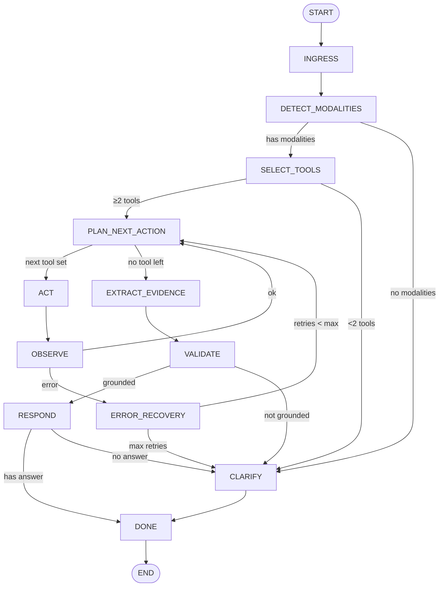

# Multimodal Agent

A LangGraph-based agent that analyzes files across multiple modalities (image, document, audio), gathers evidence from each, validates grounding across at least two modalities, and produces a confidence-scored answer. Includes error recovery and a fallback clarification path.

---

## Tech Stack

| Tool | Purpose |
|------|---------|
| **Python 3.12+** | Runtime |
| **LangGraph ≥ 1.2.2** | Stateful agent graph framework |
| **uv** | Package manager |
| **Mermaid.js** (CDN) | Graph visualization in `visualize_graph.py` |

---

## Project Structure

```
multimodal_agent_project/
├── app.py               # Entry point — runs the agent on example files
├── agent.py             # LangGraph graph definition (12 nodes, conditional edges)
├── planner.py           # Tool selection and routing logic
├── state.py             # AgentState TypedDict + create_initial_state()
├── tools.py             # Analysis tools, modality detection, output formatting
├── visualize_graph.py   # Opens the agent graph diagram in the browser
├── examples/
│   ├── dashboard.png    # Sample image input
│   ├── context.txt      # Sample document input
│   └── optional_audio.mp3  # Sample audio input
└── pyproject.toml
```

---

## Agent Graph

The agent follows this workflow — conditional edges represent decision branches:



---

## How to Run

### 1. Install dependencies

```bash
uv sync
```

### 2. Run the agent

```bash
uv run app
# or
python app.py
```

The agent processes the example files in `examples/` and prints a formatted answer with confidence score, used modalities, and execution trace.

### 3. Visualize the agent graph

```bash
python visualize_graph.py
```

Opens an interactive Mermaid diagram of the agent graph in your default browser. The diagram is generated live from `agent.py` — it always reflects the current graph structure.
